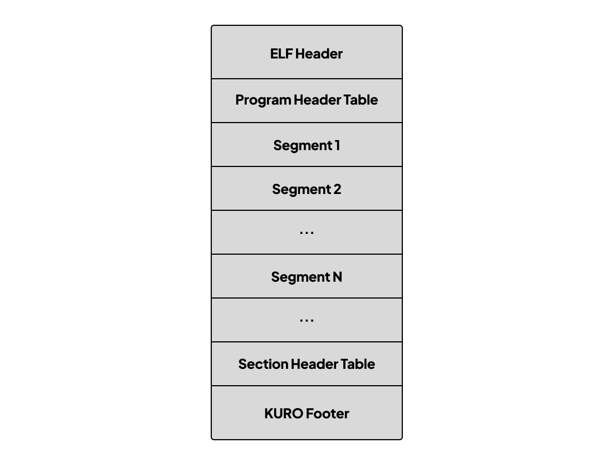
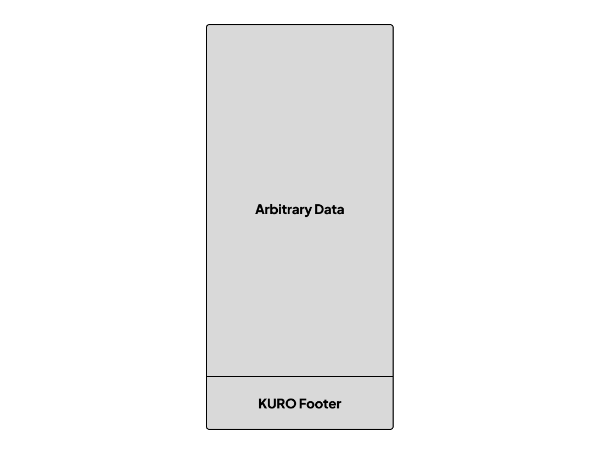
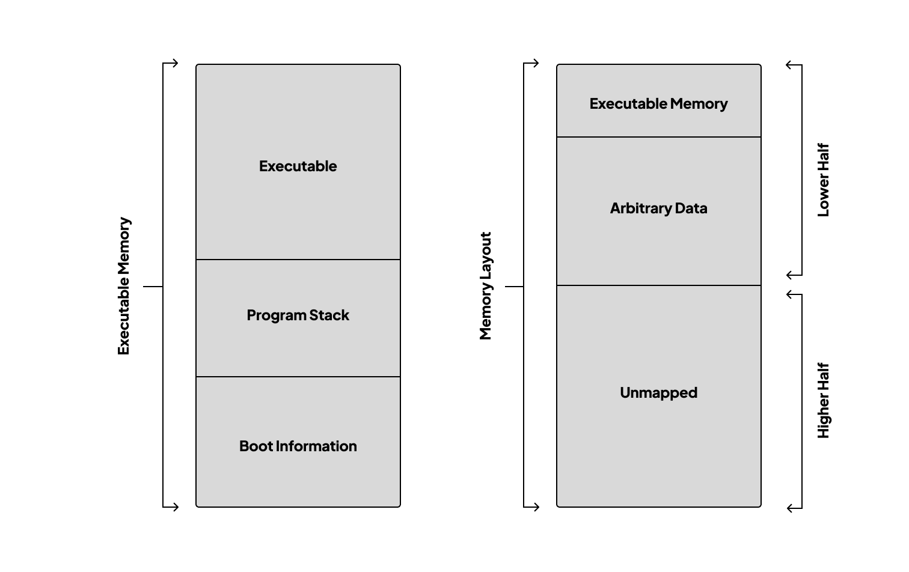

<picture>
  <source media="(prefers-color-scheme: dark)" srcset="res/kuro_banner_dark.png">
  
</picture>

# KURO Boot Protocol

***Revision `1` Errata `A`***

**2026-04-15**

## Table of Contents

1. [Introduction](#1-introduction)
    1. [About KURO](#11-about-kuro)
    2. [Target Audience](#12-target-audience)
    3. [Conventions](#13-conventions)
        1. [Typography](#131-typography)
        2. [Revisions](#132-revisions)
        3. [Data Structures](#133-data-structures)
2. [Executable Structure](#2-executable-structure)
3. [KURO Footer](#3-kuro-footer)
4. [KURO Identifier](#4-kuro-identifier)
5. [Calling Convention and Registers](#5-calling-convention-and-registers)
    1. [x86-64 Registers](#51-x86-64-registers)
    2. [ARM64 Registers](#52-arm64-registers)
6. [KURO Boot Information](#6-kuro-boot-information)
7. [KURO Memory Map](#7-kuro-memory-map)
8. [KURO Module](#8-kuro-module)
9. [KURO Framebuffer](#9-kuro-framebuffer)
10. [KURO Executable Information](#10-kuro-executable-information)
    1. [KuroSegmentInfo](#101-kurosegmentinfo)
11. [Memory Layout](#11-memory-layout)
    1. [Executable Memory](#111-executable-memory)
    2. [Lower Half](#112-lower-half)
    3. [Higher Half](#113-higher-half)
12. [Appendix A: Bootloader Identifier String](#appendix-a-bootloader-identifier-string)
13. [Appendix B: Legacy Boot Protocols](#appendix-b-legacy-boot-protocols)
14. [Appendix C: Changes](#appendix-c-changes)
15. [Contact](#contact)
16. [Copyright](#copyright)
17. [References](#references)

## 1. Introduction

This document describes the protocols used by the KURO bootloader to load executables.

This document is intended to provide a reference for developers who want to create executables that can be loaded by the
KURO bootloader or to create their own bootloader that follows the KURO boot protocol.

## 1.1 About KURO

KURO is both a bootloader and boot protocol. It is designed to be opinionated, secure, and minimalistic.

It supports UEFI `x86-64` and `ARM64` environments.

## 1.2 Target Audience

Kernel developers, operating system developers, and anyone inbetween who wants to develop a bootloader that is
compliant with the KURO boot protocol or kernel developers who want to create an executable that can be loaded by
the KURO bootloader.

This document assumed you have an understanding of the following topics:

- ELF[^1]
- UEFI[^2]
- Virtual memory and paging of your target architecture

## 1.3 Conventions

These are the conventions used throughout this document.

### 1.3.1 Typography

      The key words "MUST", "MUST NOT", "REQUIRED", "SHALL", "SHALL
      NOT", "SHOULD", "SHOULD NOT", "RECOMMENDED",  "MAY", and
      "OPTIONAL" in this document are to be interpreted as described in
      RFC 2119.

### 1.3.2 Revisions

Updates to this document are considered either revisions or errata as described below:
- A new revision is made when significant changes are made to the document. Which changes the behavior of the
  bootloader, executable, or the booting process such as adding a new feature or fixing a bug.
- Errata version is made when a typo is found in the document or a minor change is made to the document that does not
  affect the behavior of the bootloader, executable, or the booting process such as fixing a typo or updating a link.

> [!CAUTION]
> Not all commits of the document are considered final. Please refer to the git tag for each final version of the
> document.

### 1.3.3 Data Structures

All data structures are presented in C syntax with the padding implicitly added to ensure that the structure alignment
follows the standard C alignment rules.

All the fields must not be null or 0 unless stated otherwise.

All the pointers are fixed to be in the higher half of the address space by the bootloader unless stated otherwise.

Any type that starts with `EFI_` is an UEFI type and is defined in the UEFI specification[^2].

## 2. Executable Structure

A valid KURO executable must be a Position-independent executable (PIE).

The following diagram shows an example structure of a KURO executable:



- The executable must be a position-independent executable (PIE) with ELF header field `e_type` set to `ET_DYN`.
- The executable must contain a KURO footer at the end of the file.

The bootloader must verify the ELF header and KURO footer to ensure that the executable is a valid KURO executable.

## 3. KURO Footer

The KURO footer is a fixed-size data structure located at the end of the file. It contains the signature of
the file and the KURO identifier that is used to verify the authenticity of the file that is loaded by the bootloader.

Starting from 72 bytes before the end of the executable, lies the KURO footer. The KURO footer contains the following
fields:

```c++
typedef struct {
    char k_signature[64];
    KuroIdentifier k_identifier;
} KuroFooter;
```

> [!TIP]
> You can create a KURO footer on an existing ELF executable that follows [section 2](#2-executable-structure) by using
> the `kuro-sign`[^6] tool.

#### k_signature

The signature is an Ed25519[^3] signature of the executable to verify its authenticity. The signature is calculated over
the entire executable file, excluding the KURO footer itself.

The bootloader must verify the signature of the file before loading it fully except for when the UEFI secure boot is
disabled.

The bootloader must ensure that the public key and configuration are not tampered with.

#### k_identifier

As described in [section 4.1](#4-kuro-identifier).

## 4. KURO Identifier

KURO identifier is a fixed-size structure that contains the magic number and version information used to identify the
validity of a file and structure.

```c++
typedef struct {
    char k_magic0;
    char k_magic1;
    char k_magic2;
    char k_magic3;
    char k_magic4;
    uint8_t k_version;
    char k_reserved[2];
} KuroIdentifier;
```

#### k_magic

The magic number is `0x7F` followed by `KURO` in ASCII, which is `0x4B 0x55 0x52 0x4F` in hexadecimal.

If the magic number does not match the expected magic number, it must not be loaded.

| Byte     | Value  |
|----------|--------|
| k_magic0 | `0x7F` |
| k_magic1 | `0x4B` |
| k_magic2 | `0x55` |
| k_magic3 | `0x52` |
| k_magic4 | `0x4F` |

#### k_version

The sixth byte of the KURO identifier is used to identify the version of the KURO boot protocol used by the
executable.

If the version does not match the supported version, it must not be loaded.

Any other undefined version number is considered reserved for future use.

| Revision | Description                        |
|----------|------------------------------------|
| `0`      | Invalid Revision                   |
| `1`      | KURO Boot Protocol `Legacy 1.0`    |
| `2`      | KURO Boot Protocol `Legacy 2.0`    |
| `3`      | KURO Boot Protocol `1.0` (current) |

Information regarding the legacy boot protocols can be found in [appendix B](#appendix-b-legacy-boot-protocols).

## 5. Calling Convention and Registers

As before the bootloader transfers control to the entry point of the executable, the bootloader must prepare the
boot information structure and pass it to the executable following the ABI/calling convention in the register for each
architecture.

The return address must be null at the time the control is transferred to the executable.

### 5.1 x86-64 Registers

Following the System V AMD64 ABI[^4].

`rdi` - Pointer to the KURO boot information.

### 5.2 ARM64 Registers

Following the Procedure Call standard for the Arm 64-bit Architecture[^5].

`x0` - Pointer to the KURO boot information.

## 6. KURO Boot Information

The boot information structure is a data structure that contains information that the executable must use. The
structure contains the following fields:

```c++
typedef struct {
    KuroIdentifier kb_identifier;
    char *kb_boot_id;
    char *kb_cmdline;
    EFI_SYSTEM_TABLE *kb_system_table;
    KuroMemoryMap *kb_memory_map;
    KuroModule *kb_module;
    KuroFramebuffer *kb_framebuffer;
    KuroExecutableInfo *kb_executable_info;
} KuroBootInfo;
```

#### kb_identifier

As described in [section 4](#4-kuro-identifier).

#### kb_boot_id

Points to a null-terminated string that contains the boot identifier of the bootloader.
See [appendix A](#appendix-a-bootloader-identifier-string) for the list of boot identifiers.

#### kb_cmdline

Points to a null-terminated string that contains the command line passed to the executable.
The command line is passed to the executable as-is and does not contain any modifications.

This field can be null if no command line is passed to the executable.

#### kb_system_table

Pointer to the EFI system table. Please refer to the UEFI specification[^2] for more information about the EFI system table.

Even though the system table is a pointer that points to the EFI system table in the higher half address space,
the system table will be handed to the executable as-is, which means that the executable must fix the pointers inside
the system table to be in the higher half of the address space by offsetting them by the `km_higher_half_base` value.

#### kb_memory_map

Pointer to the memory map structure.
As described in [section 7](#7-kuro-memory-map).

#### kb_module

Pointer to the module structure.
As described in [section 8](#8-kuro-module).

This field can be null if no module is loaded.

#### kb_framebuffer

Pointer to the framebuffer structure.
As described in [section 9](#9-kuro-framebuffer).

This field can be null if no framebuffer is available.

#### kb_executable_info

Pointer to the executable information structure.
As described in [section 10](#10-kuro-executable-information).

## 7. KURO Memory Map

The memory map structure is a data structure that contains information about the memory map of the system. The
structure contains the following fields:

```c++
typedef struct {
    EFI_MEMORY_DESCRIPTOR *km_map;
    uint64_t km_map_size;
    uint64_t km_desc_size;
    uint32_t km_desc_version;
    uintptr_t km_higher_half_base;
    uint64_t km_execmem_size;
    uint64_t km_progstack_size;
    uint64_t km_bootinfo_size;
    uintptr_t km_bootinfo_base;
} KuroMemoryMap;
```

#### km_map

Point to the start of the memory descriptor array as defined in the UEFI specification[^2].

This memory map is the same as the one that is used to call `SetVirtualAddressMap()` in UEFI.
The `VirtualStart` must be the same as the `PhysicalStart + km_higher_half_base`.

See [section 11](#11-memory-layout) for more information.

#### km_map_size

Specifies the size of the memory map array in bytes.

#### km_desc_size

Specifies the size of each memory descriptor in bytes.

#### km_desc_version

Specifies the version of the memory descriptor structure as defined in the UEFI specification[^2].

#### km_higher_half_base

Specifies the base address of the higher half.
See [section 11.3](#113-higher-half) for more information.

#### km_execmem_size

Specifies the size of the executable region in pages.
For more information about this field and the three other fields below, see [section 11.1](#111-executable-memory).

#### km_progstack_size

Specifies the size of the program stack region in pages.

#### km_bootinfo_size

Specifies the size of the boot information region in pages.

#### km_bootinfo_base

Specifies the base address of the boot information region in the virtual address.

## 8. KURO Module

The module structure is a data structure that contains information about the module that is loaded into memory. The
structure contains the following fields:

```c++
typedef struct {
    void *km_module_base;
    uint64_t km_module_size;
} KuroModule;
```

#### km_module_base

Points to the base address of the module.

#### km_module_size

Specifies the size of the module in bytes.

### 8.1 Module Structure

A module is an arbitrary binary file loaded into memory by the bootloader.
The module must contain a KURO footer at the end of the file. There must be only one module loaded.

The bootloader must verify the KURO footer and then load the module into memory as-is but excluding the KURO footer.

The structure of a module can be found in the following diagram:



The KURO footer is described in [section 3](#3-kuro-footer).

## 9. KURO Framebuffer

The framebuffer structure is a data structure that contains information about the framebuffer. The structure contains
the following fields:

```c++
typedef struct {
    void *kf_base;
    uint64_t kf_size;
    uint32_t kf_width;
    uint32_t kf_height;
    uint32_t kf_pixels_per_scanline;
    EFI_GRAPHICS_PIXEL_FORMAT kf_pixel_format;
    EFI_PIXEL_BITMASK kf_pixel_info;
} KuroFramebuffer;
```

> [!TIP]
> This structure is heavily dependent on the UEFI specification[^2].

#### kf_base

Points to the base address of the framebuffer.

#### kf_size

Specifies the size of the framebuffer in bytes.

#### kf_width

Specifies the horizontal resolution of the framebuffer.

#### kf_height

Specifies the vertical resolution of the framebuffer.

#### kf_pixels_per_scanline

Specifies the number of pixels per scanline.

#### kf_pixel_format

As defined in the UEFI specification[^2].

#### kf_pixel_info

As defined in the UEFI specification[^2].

## 10. KURO Executable Information

The executable information structure is a data structure that contains information about the loaded executable. The
structure contains the following fields:

```c++
typedef struct {
    uintptr_t ke_entry_point;
    uint64_t ke_segment_count;
    KuroSegmentInfo* ke_segments;
    uint64_t ke_stack_start;
    uint64_t ke_stack_size;
} KuroExecutableInfo;
```

#### ke_entry_point

This field contains the address to the entry point of the executable in virtual address.

#### ke_segment_count

This field specifies the number of entries in the `ke_segments` array.

#### ke_segments

Points to an array of `KuroSegmentInfo` structures as defined in [section 10.1](#101-kurosegmentinfo).

#### ke_stack_start

Specifies the top of the stack at the time the control is transferred to the executable in virtual address.

##### x86-64

Following the System V ABI, the alignment of the stack must be misaligned by at least eight bytes as shown in
the following formula:

```text
ke_stack_start % 16 = 8
```

##### ARM64

for ARM64 however, the `ke_stack_start` must be aligned to `16` bytes.

#### ke_stack_size

This field contains the remaining size of the stack counting from the `ke_stack_start` address to the end of the program stack region.

### 10.1 KuroSegmentInfo

`KuroSegmentInfo` is a structure that describes a segment of the executable that has been loaded into memory. It
contains information about each segment, such as its address, size, permission, and alignment.

Each `KuroSegmentInfo` structure is defined as follows:

```c++
typedef struct {
    uint32_t ks_flags;
    uintptr_t ks_address;
    uint64_t ks_size;
    uint64_t ks_align;
} KuroSegmentInfo;
```

> [!TIP]
> This structure depends heavily on the ELF program header in the ELF specification[^1].

#### ks_flags

Specifies the permissions of the segment.

More information about the flags can be found in the ELF specification[^1].

#### ks_address

Specifies the address of the segment in virtual address.

#### ks_size

Specifies the size of the segment in memory. This value is the size of the segment in
memory in bytes.

#### ks_align

Specifies the alignment of the segment in memory. This value is the same as the `p_align`
field in the ELF program header[^1] for the segment.

## 11. Memory Layout

The bootloader must arrange the memory layout as described down below.

The bootloader should configure the virtual address space to the maximum size supported by the hardware. When there is a
bigger available virtual address space, the bootloader should use the biggest one.

The bootloader must set the page size to `4` KiB.

The permissions must be set to `RWX` for all pages.

The bootloader must set the virtual address map in UEFI Virtual Memory Services (`SetVirtualAddressMap()`) to the higher
half to ensure that the UEFI Runtime Services are usable at the time the control is transferred to the executable.

### 11.1 Executable Memory

The executable memory and the memory layout are laid out as shown in the following diagram:



Each region is separated by a page boundary, and each region is defined in order from top to bottom as follows:

- **Executable region** – Contains executable code and data
- **Program stack region** – Contains program stack
- **Boot information region** – Contains information that is being passed to the executable from the bootloader

Each region must not overlap and must be big enough to contain the contents of the region.
It must be contiguous and must not have gaps in between any of the regions.

The executable region must contain the executable code and data.

The program stack must be located below the executable code and data pages.

Below the program stack is the boot information region which must contain the information passed to the
executable both explicitly and implicitly, including but not limited to:

- KuroBootInfo
- `kb_cmdline`
- `kb_boot_id`
- KuroMemoryMap
- KuroModule
- KuroFramebuffer
- KuroExecutableInfo
- EFI_SYSTEM_TABLE

The executable memory should be placed at the highest address in the memory as possible, and all the regions must be
null-initialized first beforehand.

The executable memory must not be placed in the memory not considered free in the EFI memory map. It is recommended to
use the EFI allocators to allocate the executable memory.

### 11.2 Lower Half

This region must not be mapped to any physical address when the control is transferred to the executable.

### 11.3 Higher Half

This region is mapped to every physical address with an offset, and the offset is the base address of the higher half.

The bootloader must configure the paging table to only allow privileged access to the higher half.

This formula must always be true at the time the control is transferred to the executable:

```text
Virtual Address = Physical Address + Higher Half Base
```

The offset can be obtained from the `kb_memory_map` structure as described in [section 7](#7-kuro-memory-map).

## Appendix A: Bootloader Identifier String

This table lists the bootloader identifier strings that are currently known by the documents.

| Bootloader Identifier String | Description         |
|------------------------------|---------------------|
| `UNKNOWN`                    | Unknown Bootloader. |
| `KURO`                       | KURO Bootloader.    |

> [!NOTE]
> If you would like to add a new bootloader identifier string to this table, please [contact](#contact) the author of
> this document.

## Appendix B: Legacy Boot Protocols

Due to the lack of real-world usage and impracticality in the first two revisions of the KURO boot protocol, they are considered legacy and
should never be used. Those revisions are now considered legacy and the count is reset to `1`.

## Appendix C: Changes

- `Legacy 1.0` – Initial release.
- `Legacy 2.0`
    - Added support for passing arbitrary data to the executable. This allows the bootloader to pass data depending on
      the bootloader implementation.
    - Added explicit reservations for the other registers that are passed to the executable for future use.
    - Remove the requirement for signature verification however, it is encouraged to verify the signature anyway.
    - Clarified the requirements of having no relocations in the executable by explicitly stating the disallowed program
      segment types and exception to it.
    - Added caution about UEFI memory allocation.
    - Update `k_version` from `1` to `2`.
    - Changed stack location to be implementation-defined.
    - Added `ke_stack_end` field to the executable information structure.
    - Added Bootloader Identifier String to the arguments provided to the executable and the table containing the
      currently known bootloader identifier strings by the document.
    - Stack alignment is now `16` bytes.
    - Added an image handle to the arguments provided to the executable.
    - Added `ke_entry_point` field to the executable information structure.
    - Clarified the pointer and stack in the arguments provided to the executable.
    - Clarified versioning of this document.
    - Removed the farewell section from this document.
    - Added the contact section to this document.
    - Added the changes section to this document.
    - Renamed from KURO Booting Convention to KURO Boot Protocol.
- `1.0`
    - Fixed the stack alignment
    - Removed `ke_stack_end` field from the executable information structure.
    - Removed reductant sections from the document.
    - Bump the version to `3`.
    - Added support for ARM64.
    - Boot service is now being exited.
    - Added boot information structure.
    - Added framebuffer structure.
    - Added module structure.
    - Added memory map structure.
    - Defined memory layout.
    - Changed position of the KURO identifier.
    - Please refer to git history for details.

## Contact

In case of any questions or suggestions, please feel free to email
[mono@themonhub.net](mailto:mono@themonhub.net)

This document was written and maintained by [TheMonHub](https://github.com/TheMonHub).

You can get a copy of this document in here:
https://github.com/TeamSHIRO/KURO/blob/main/docs/kuro_boot_protocol.md.

## Copyright

Copyright 2026 TheMonHub

This work is licensed under a
[Creative Commons Attribution 4.0 International](https://creativecommons.org/licenses/by/4.0/) License.


## References

The following publications and sources of information may be useful for understanding this document or are referred to
in this document:

[^1]: **ELF Executable and Linkable Format, Xinuos** – https://gabi.xinuos.com/elf/

[^2]: **Unified Extensible Firmware Interface Specification, Version 2.11** – https://uefi.org/sites/default/files/resources/UEFI_Spec_Final_2.11.pdf

[^3]: **Ed25519, Wikipedia** – https://en.wikipedia.org/wiki/EdDSA#Ed25519

[^4]: **System V ABI for the X86-64 Architecture, GitLab** – https://gitlab.com/x86-psABIs/x86-64-ABI

[^5]: **Procedure Call Standard for the Arm 64-bit Architecture, GitHub** – https://github.com/ARM-software/abi-aa/blob/main/aapcs64/aapcs64.rst

[^6]: **kuro-sign, GitHub** – https://github.com/TeamSHIRO/kuro-sign